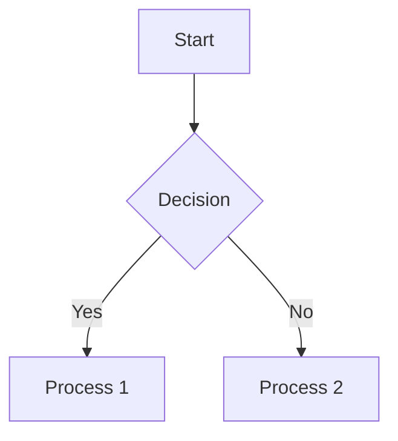
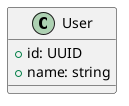

# Technical Documentation Writing Guide

Guidelines and best practices for writing clear, comprehensive technical documentation.

## When to Use

Load this skill when:
- Writing API documentation
- Creating README files
- Documenting code (comments, docstrings)
- Writing tutorials or guides
- Creating architecture documentation
- Setting up documentation systems

## Quick Reference

### Documentation Types
```
📄 README.md          - Project overview, quick start
📄 API.md             - API endpoint documentation
📄 CONTRIBUTING.md   - Contribution guidelines
📄 ARCHITECTURE.md   - System design, components
📄 TUTORIAL.md        - Step-by-step guides
📄 CHANGELOG.md       - Version history
```

### Markdown Templates
```markdown
## Quick Start
1. Install: `npm install`
2. Configure: Edit `config.json`
3. Run: `npm start`

## API Reference
### `functionName(param1, param2)`
> Brief description of what the function does.

**Parameters:**
- `param1` (string, required): Description
- `param2` (number, optional): Description

**Returns:** Description of return value

**Example:**
\```javascript
const result = functionName("test", 123);
console.log(result);
\```
```

## README Structure

### Standard README Template
```markdown
# Project Name

> One-line description of the project

[](build-url)
[](version-url)

## Features
- ✨ Feature 1: Brief description
- 🚀 Feature 2: Brief description
- 🔒 Feature 3: Brief description

## Quick Start
\```bash
# Install
npm install my-library

# Usage
import { myFunction } from 'my-library';
\```

## Documentation
- [API Reference](API.md)
- [Contributing](CONTRIBUTING.md)
- [Changelog](CHANGELOG.md)

## License
[MIT](LICENSE)
```

## API Documentation

### REST API Endpoint
```markdown
### GET /api/users/{id}

Retrieve a user by ID.

**URL Parameters:**
- `id` (required): User ID (UUID)

**Headers:**
- `Authorization: Bearer <token>` (required)
- `Accept: application/json` (optional)

**Response:**
\```json
{
  "id": "123e4567-e89b-12d3-a456-426614174000",
  "name": "John Doe",
  "email": "john@example.com"
}
\```

**Error Responses:**
- `404 Not Found`: User not found
- `401 Unauthorized`: Invalid or missing token
```

### Function/Method Documentation
```go
// GetUser retrieves a user by ID from the database.
// If the user does not exist, it returns ErrNotFound.
//
// Parameters:
//   - ctx: Context for cancellation and timeouts
//   - id: User ID (UUID format)
//
// Returns:
//   - *User: The user object if found
//   - error: ErrNotFound if user doesn't exist, or other error
func GetUser(ctx context.Context, id string) (*User, error) {
    // ...
}
```

## Writing Style

### Do's ✅
- Use active voice: "Click the button" not "The button should be clicked"
- Be concise: Remove filler words
- Use present tense: "Returns the value" not "Will return"
- Include examples: Show, don't just tell
- Use consistent terminology: Pick one term and stick with it
- Structure with headers: Make it scannable

### Don'ts ❌
- Avoid jargon without explanation
- Don't assume prior knowledge without linking
- Avoid long paragraphs (keep under 3-4 sentences)
- Don't use "obviously" or "simply" (alienating)
- Avoid passive voice in instructions

## Code Examples

### Good Code Examples
```javascript
// ✅ Good: Clear, complete, with comments
/**
 * Calculates the total price including tax.
 * @param {number} subtotal - The subtotal amount
 * @param {number} taxRate - Tax rate as decimal (e.g., 0.1 for 10%)
 * @returns {number} Total price
 */
function calculateTotal(subtotal, taxRate) {
  const tax = subtotal * taxRate;
  return subtotal + tax;
}

// Usage example
const total = calculateTotal(100, 0.1); // 110
```

### Bad Code Examples (and fixes)
```python
# ❌ Bad: No context, unclear variable names
def p(l):
    for i in l:
        print(i)

# ✅ Good: Clear function name, descriptive variables
def print_items(items):
    """Print each item in the list."""
    for item in items:
        print(item)
```

## Documentation Tools

### Generators
| Tool | Language | Output |
|------|----------|--------|
| Swagger/OpenAPI | All | Interactive API docs |
| JSDoc | JavaScript | HTML documentation |
| Sphinx | Python | HTML, PDF, ePub |
| Godoc | Go | HTML (from code) |
| GitBook | Markdown | Beautiful docs site |

### Markdown Enhancements
```bash
# Mermaid for diagrams (in Markdown)


# PlantUML for UML

```

## README Checklist

Before publishing, verify:
- [ ] Clear project description (one-line)
- [ ] Badges (build, version, license)
- [ ] Installation instructions
- [ ] Usage examples
- [ ] API documentation linked
- [ ] Contributing guidelines
- [ ] License file
- [ ] Live demo or screenshots (if applicable)
- [ ] Table of contents (for long READMEs)

## Pitfalls

### Outdated Documentation
**Problem**: Docs don't match code  
**Solution**: 
- Update docs in same PR as code changes
- Use CI to check docs build
- Review docs during code review

### Too Much Jargon
**Problem**: Unclear to beginners  
**Solution**: 
- Define terms on first use
- Link to explanations
- Provide "Prerequisites" section

### Missing Examples
**Problem**: Users can't figure out usage  
**Solution**: 
- Include at least one complete example
- Show both simple and advanced usage
- Provide copy-pasteable code

## Verification

After writing documentation:
1. Spell-check: `codespell .` or your IDE
2. Link check: `markdown-link-check README.md`
3. Render preview: Most Markdown editors have preview
4. Test all code examples manually
5. Have someone unfamiliar read it for clarity

## Tools & References

- [Google Technical Writing Course](https://developers.google.com/tech-writing)
- [Write the Docs](https://www.writethedocs.org/)
- [Markdown Guide](https://www.markdownguide.org/)
- [API Documentation Best Practices](https://swagger.io/resources/articles/best-practices-in-api-documentation/)
- [README Best Practices](https://github.com/ddmee/readme-best-practices)
